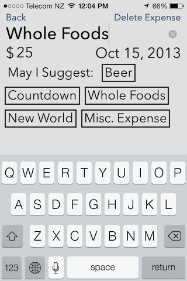
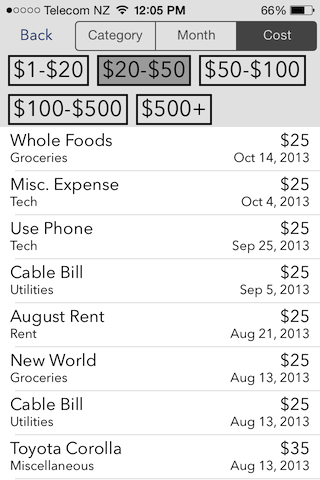

This is a special interest project, as I have always maintained personal finance and spending spreadsheets for budget, analysis, and fun.

The design intent was to provide a minimal, intuitive, and dynamic interface. Emphasis on quickly logging an expense with minimal clicks and using prior expenses to provide suggestions for descriptions of repeat purchases.

Basic expense analysis is currently implemented, to allow viewing expenses by category, month, or cost range.  

Future developments will include much more in depth analysis, budget calculations, graphs, and integration with a web service.

  